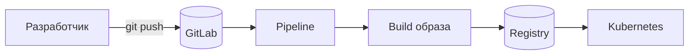
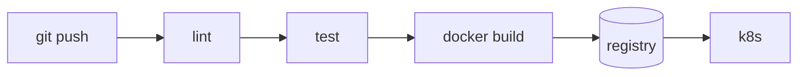
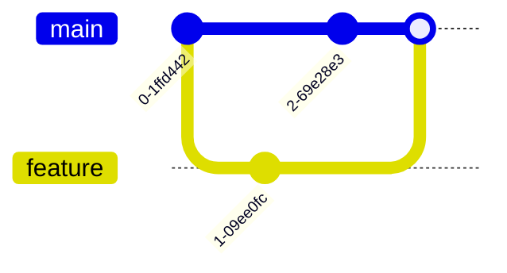

# 10. Markdown: README, документация, конспекты

> Роадмап → 1. Git → Теория → Концепции: **«Markdown (.md) — формат README, документации,
> конспектов»**.
> **После темы ты умеешь:** писать README, который читают; оформлять документацию
> и конспекты (вот эти самые) так, чтобы они одинаково выглядели в GitHub, GitLab и Obsidian.

---

## 🗺️ Карта темы

```text:no-line-numbers
  .md — обычный текстовый файл со служебными символами
        │
        ├── лежит в git рядом с кодом → версионируется, ревьюится в MR (docs as code)
        ├── GitHub/GitLab рендерят автоматически: README.md на главной странице
        ├── Obsidian — твои конспекты (+ [[вики-ссылки]])
        └── mkdocs / Docusaurus / GitLab Pages → сайт документации из тех же файлов

  Диалекты:
   CommonMark  ← базовый стандарт
   GFM (GitHub Flavored Markdown) ← + таблицы, задачи, зачёркивание, автоссылки
   GitLab Flavored Markdown       ← GFM + mermaid, ссылки на issue/MR
   Obsidian                       ← GFM + [[wiki-links]], callouts, ^блоки
```

---

## 1. Зачем DevOps'у Markdown

- **README.md** — первое, что видит человек (и ты сам через полгода) в любом репозитории.
- **Runbook'и и инструкции по инцидентам** — «что делать, если упал payment-service».
- **ADR** (Architecture Decision Record) — «почему выбрали Kafka, а не RabbitMQ».
- **Конспекты** (вот эти) — учебная база, которая заодно тренирует git.
- **Docs as code**: документация лежит в том же репозитории, меняется тем же MR,
  проходит ревью и линтер, публикуется пайплайном.

> 💡 Правило: **если знание не записано в репозитории — его нет**. Самый частый источник
> боли в эксплуатации — «знал только Марат, а Марат в отпуске».

---

## 2. Базовый синтаксис

````markdown
# Заголовок 1        (в файле обычно один — название документа)
## Заголовок 2
### Заголовок 3

Обычный текст. Перенос строки — две пустые… нет: два пробела в конце строки
или пустая строка между абзацами.

**жирный**, *курсив*, ***жирный курсив***, ~~зачёркнутый~~, `код в строке`

- маркированный список
- второй пункт
  - вложенный (2-4 пробела)

1. нумерованный
2. второй
   1. вложенный

> Цитата — часто используется для важных заметок
> и продолжается на второй строке.

---              ← горизонтальная линия

[текст ссылки](https://example.com)
[относительная ссылка](../../DevOps/CICD/00_INDEX.md)


`inline code` и блок:

```bash
docker compose up -d
```

| Колонка | Описание |
|---------|----------|
| `--rm`  | удалить контейнер после выхода |
| `-d`    | фоновый режим |

- [x] выполненная задача
- [ ] невыполненная задача
````

### Тонкости, на которых спотыкаются

| Что | Как правильно |
|-----|---------------|
| Перенос строки внутри абзаца | Два пробела в конце строки или `\` |
| Таблица | Обязательна строка `|---|---|` после заголовка |
| Код с подсветкой | ` ```bash `, ` ```yaml `, ` ```python `, ` ```diff ` |
| Блок кода внутри списка | Отступ в 4 пробела/по уровню пункта |
| Символы `*`, `_`, `` ` `` в тексте | Экранировать `\*` или обернуть в `` `код` `` |
| Пустая строка перед списком/таблицей | Обязательна, иначе не отрендерится |
| HTML | Работает в GitHub/GitLab: `<details>`, `<br>`, `` |

### Свёртка — очень полезно для конспектов и README

````markdown
<details>
<summary>Показать полный вывод команды</summary>

```
много строк лога
```

</details>
````

Именно так в этих конспектах спрятаны ответы к задачам.

---

## 3. README.md, который читают

Структура, которую ждёт любой инженер:

````markdown
# Имя сервиса

Одно предложение: что это и зачем. Без «данный репозиторий предназначен для».

## Быстрый старт
```bash
git clone git@gitlab.com:team/service.git && cd service
cp .env.example .env
docker compose up -d
curl localhost:8080/healthz
```

## Требования
- Docker 24+, docker compose v2
- доступ к registry `registry.company.kz`

## Конфигурация
| Переменная | Обязательна | По умолчанию | Описание |
|------------|-------------|--------------|----------|
| `DB_HOST`  | да          | —            | хост Postgres |
| `LOG_LEVEL`| нет         | `info`       | уровень логов |

## Как запустить тесты
## Как задеплоить (и кто может)
## Архитектура (схема)
## Куда смотреть при инциденте (дашборд, логи, runbook)
## Контакты / владелец сервиса
````

Правила хорошего README:
1. **Первый экран отвечает на «что это»** — без прокрутки.
2. Команды копируются и работают (проверь на чистой машине!).
3. Никаких секретов и внутренних токенов в примерах.
4. Обновляется тем же MR, что и изменение поведения — иначе устаревает за месяц.
5. Ссылки на соседние документы: runbook, ADR, дашборды.

---

## 4. Что умеют хостинги сверх базового Markdown

| Возможность | GitHub | GitLab | Obsidian |
|-------------|--------|--------|----------|
| Таблицы, задачи, зачёркивание (GFM) | ✅ | ✅ | ✅ |
| Подсветка синтаксиса | ✅ | ✅ | ✅ |
| `<details>` / HTML | ✅ | ✅ | частично |
| **Mermaid-диаграммы** | ✅ | ✅ | ✅ |
| Ссылки `#123` на issue/MR | ✅ | ✅ (`!45`, `#12`, `@user`) | ❌ |
| Оглавление | авто-якоря | `[[_TOC_]]` | плагин/панель |
| `[[вики-ссылки]]` | ❌ | ❌ | ✅ |
| Callout-блоки `> [!NOTE]` | ✅ | частично | ✅ |
| Footnotes `[^1]` | ✅ | ✅ | ✅ |

### Mermaid — схемы прямо в тексте

````markdown

````

Работает в GitHub, GitLab и Obsidian. Для DevOps-документации — идеальный способ рисовать
пайплайны и архитектуру: диаграмма лежит текстом в git, её видно в diff'е MR.

### Callouts (заметки)

```markdown
> [!NOTE] Полезно знать
> [!TIP] Совет
> [!WARNING] Осторожно
> [!CAUTION] Опасно
```

---

## 5. Markdown в Obsidian (твой случай)

Твои конспекты лежат в Obsidian-хранилище, которое **одновременно является git-репозиторием** —
это и есть практика роадмапа «пушить конспекты в .md».

Особенности Obsidian:
- `[[имя файла]]` — вики-ссылка; `[[файл|подпись]]`; `![[файл]]` — встраивание.
  ⚠️ На GitHub/GitLab такие ссылки **не работают** — если конспекты нужно читать в вебе,
  используй обычные `[текст](путь.md)` (в этих конспектах так и сделано).
- Граф связей, теги `#devops/git`, свойства (YAML-фронтматтер в начале файла):
  ```markdown
  ---
  tags: [git, devops, роадмап]
  дата: 2026-09-13
  ---
  ```
  Хостинги покажут фронтматтер как текст или таблицу — это нормально.
- `.obsidian/` (настройки хранилища) обычно **добавляют в `.gitignore`**, чтобы не тащить
  локальные настройки и плагины; либо версионируют осознанно, если работаешь с двух машин.

Типичный `.gitignore` для vault:
```text:no-line-numbers
.obsidian/workspace.json
.obsidian/cache
.trash/
*.excalidraw.md.bak
```

---

## 6. Линтеры и автоматизация

```bash
npx markdownlint-cli2 "**/*.md"       # проверка стиля
npx markdown-link-check README.md     # битые ссылки
```

В CI (блок CI/CD):
```yaml
docs-lint:
  stage: test
  image: node:20-alpine
  script:
    - npx markdownlint-cli2 "**/*.md"
  rules:
    - changes: ["**/*.md"]
```

Публикация документации из тех же файлов:
```bash
pip install mkdocs-material
mkdocs serve                 # локально
mkdocs build                 # статический сайт → GitLab Pages / GitHub Pages
```

---

## 7. Мини-стандарт оформления (для своих конспектов)

Чтобы 30 файлов выглядели как один документ:
1. Один `# Заголовок` на файл, дальше `##`/`###`.
2. Единая структура: карта темы → теория → примеры → грабли → «как это в DevOps» →
   шпаргалка → «что запомнить» → ссылка на следующую тему.
3. Команды — в блоках с указанием языка (`bash`, `yaml`).
4. Таблицы для «команда → что делает» и сравнений.
5. Эмодзи-якоря разделов (⭐ важное, ⚠️ грабли, 💡 совет, 🧠 итог) — быстро цепляют глаз
   при повторении.
6. Относительные ссылки между файлами — работают и в Obsidian, и на хостинге.
7. Имена файлов: `NN_тема.md`, латиницей, без пробелов — иначе ссылки ломаются в вебе.

---

## 💼 Как это в DevOps

- **Docs as code** — стандарт зрелых команд: документация в git, ревью в MR, публикация
  пайплайном. Docx в почте не версионируется и устаревает мгновенно.
- **Runbook в Markdown** — то, что читает дежурный в 3 часа ночи: симптом → проверка →
  действие → эскалация. Пишется коротко, командами, без лирики.
- **ADR** — три абзаца: контекст, решение, последствия. Через год спасает от вопроса
  «зачем мы это сделали».
- В MR описание тоже Markdown: чек-листы `- [ ]`, ссылки на задачи, свёрнутые логи
  в `<details>` — это часть культуры ревью.
- Мой личный критерий качества README: сможет ли новый человек поднять сервис локально,
  не задав ни одного вопроса в чат.

---

## 📌 Шпаргалка

| Хочу | Как |
|------|-----|
| Заголовки | `#`, `##`, `###` |
| Жирный / курсив / зачёркнутый | `**текст**` / `*текст*` / `~~текст~~` |
| Код в строке / блоком | `` `код` `` / ```` ```bash … ``` ```` |
| Ссылка / на файл рядом | `[текст](url)` / `[текст](../../DevOps/CICD/00_INDEX.md)` |
| Картинка | `` |
| Таблица | `\| a \| b \|` + `\|---\|---\|` |
| Чек-лист | `- [x]` / `- [ ]` |
| Цитата/заметка | `> текст`, `> [!WARNING]` |
| Свернуть блок | `<details><summary>…</summary> … </details>` |
| Диаграмма | блок ` ```mermaid ` |
| Оглавление (GitLab) | `[[_TOC_]]` |
| Проверить стиль | `npx markdownlint-cli2 "**/*.md"` |
| Сайт из документации | `mkdocs build` + Pages |

---

## 🧠 Что запомнить

1. Markdown — **обычный текст**, поэтому он версионируется и ревьюится как код.
2. `README.md` рендерится на главной странице репозитория — это лицо проекта.
3. Диалекты различаются: GFM (GitHub), GitLab Flavored (mermaid, `[[_TOC_]]`),
   Obsidian (`[[вики-ссылки]]`, callouts).
4. **`[[вики-ссылки]]` не работают на GitHub/GitLab** — для публичных конспектов
   используй `[текст](путь.md)`.
5. Таблице нужна строка `|---|`, спискам и таблицам — пустая строка перед ними.
6. `<details>` сворачивает длинные блоки — удобно для ответов и логов.
7. **Mermaid** позволяет держать схемы текстом в git и видеть их изменения в diff'е.
8. Хороший README: что это → быстрый старт → конфигурация → деплой → куда смотреть
   при инциденте; команды должны работать копипастой.
9. Документация живёт **в том же MR**, что и изменение кода, иначе устаревает.
10. Линтер Markdown и проверка ссылок ставятся в CI так же, как линтер кода.
11. Для Obsidian-хранилища в git: `.obsidian/workspace.json` и кэш — в `.gitignore`.

---

## Задачи

> Стенд: репозиторий с конспектами + аккаунт GitHub/GitLab (чтобы увидеть рендер)
> и Obsidian (чтобы увидеть разницу).

---

### Блок A. Теория

**A1.** Что такое Markdown и почему он удобен именно для репозитория?

<details><summary>Ответ</summary>

Лёгкий язык разметки поверх обычного текста. Для репозитория удобен тем, что это
plain text: он версионируется, показывает осмысленный diff в MR, ревьюится как код
и при этом красиво рендерится хостингом.

</details>

**A2.** Чем GFM отличается от базового CommonMark? Назови четыре возможности.

<details><summary>Ответ</summary>

GFM добавляет к CommonMark: таблицы, чек-листы `- [ ]`, зачёркивание `~~`,
автоматические ссылки, подсветку синтаксиса в блоках кода, ссылки на issue/PR, emoji-коды.

</details>

**A3.** ⭐ Какие конструкции Obsidian не работают в GitHub/GitLab? Как писать, чтобы работало везде?

<details><summary>Ответ</summary>

Не работают: `[[вики-ссылки]]`, `![[встраивание]]`, часть callout-синтаксиса,
блоки-ссылки `^id`, некоторые плагинные конструкции. Универсально: `[текст](путь.md)`,
``, обычные цитаты и таблицы.

</details>

**A4.** Как сделать перенос строки внутри абзаца (два способа)?

<details><summary>Ответ</summary>

Два пробела в конце строки либо обратный слэш `\` в конце строки (в GFM).
Пустая строка создаёт новый абзац.

</details>

**A5.** Что обязательно нужно для таблицы? А для списка после абзаца?

<details><summary>Ответ</summary>

Таблице — строка-разделитель `|---|---|` под заголовком (и пустая строка перед
таблицей). Списку — пустая строка перед первым пунктом, иначе он «прилипнет» к абзацу.

</details>

**A6.** Как вставить блок кода с подсветкой синтаксиса? Как вставить блок кода **внутрь**
другого блока кода?

<details><summary>Ответ</summary>

Тремя обратными кавычками с указанием языка: ` ```bash `. Чтобы вложить блок в блок,
внешний фенс делают длиннее — четыре обратные кавычки ` ```` `.

</details>

**A7.** Зачем нужен `<details>` и где ты его уже видел в этих конспектах?

<details><summary>Ответ</summary>

HTML-элемент сворачивания: прячет длинный блок (лог, ответы к задачам) под кликабельный
заголовок. В этих конспектах под `<details>` спрятаны ответы к задачам.

</details>

**A8.** ⭐ Что должно быть в хорошем README? Назови семь разделов по порядку.

<details><summary>Ответ</summary>

(1) Название и одно предложение «что это»; (2) быстрый старт (команды);
(3) требования/зависимости; (4) конфигурация (таблица переменных); (5) тесты;
(6) деплой и кто может; (7) эксплуатация: дашборды, логи, runbook, владелец/контакты.
(Плюс архитектурная схема.)

</details>

**A9.** Что такое mermaid и почему его любят в DevOps-документации?

<details><summary>Ответ</summary>

Язык описания диаграмм текстом, который GitHub/GitLab/Obsidian рендерят в картинку.
В DevOps любят, потому что диаграмма лежит в git, видна в diff'е MR, не требует Visio
и не устаревает отдельно от кода.

</details>

**A10.** Что такое docs as code? Три практических следствия.

<details><summary>Ответ</summary>

Документация хранится в репозитории вместе с кодом. Следствия: (1) изменения
проходят ревью в том же MR; (2) документацию можно линтовать и собирать в CI;
(3) есть история «кто и когда поменял инструкцию», и она не расходится с кодом.

</details>

**A11.** Что такое runbook и чем он отличается от README?

<details><summary>Ответ</summary>

Runbook — пошаговая инструкция на случай конкретной ситуации (инцидента):
симптом → диагностика → действие → эскалация. README отвечает «что это и как запустить»,
runbook — «что делать, когда сломалось, в три часа ночи».

</details>

**A12.** Что такое ADR и зачем его вести?

<details><summary>Ответ</summary>

Architecture Decision Record — короткая запись о принятом архитектурном решении:
контекст, рассмотренные варианты, решение, последствия. Нужен, чтобы через год знать,
почему сделали именно так, и не переигрывать решение вслепую.

</details>

**A13.** Какие файлы Obsidian-хранилища стоит положить в `.gitignore` и почему?

<details><summary>Ответ</summary>

`.obsidian/workspace.json` (позиции окон), кэши, `.trash/`: это локальные
пользовательские данные, которые меняются при каждом открытии и создают шум в diff'ах
и конфликты при работе с двух машин.

</details>

**A14.** Как проверить Markdown автоматически? Что можно поставить в CI?

<details><summary>Ответ</summary>

`markdownlint-cli2` (стиль), `markdown-link-check`/`lychee` (битые ссылки),
проверка орфографии (`cspell`), сборка сайта (`mkdocs build --strict`). Всё это ставится
джобами в пайплайн с `rules: changes: ["**/*.md"]`.

</details>

**A15.** Почему README устаревает и что с этим делать процессно?

<details><summary>Ответ</summary>

Потому что код меняется, а документацию правят «потом». Процессно: правило
«изменил поведение — правь документацию в том же MR», чек-лист в шаблоне MR,
CODEOWNERS на каталог `docs/`, периодическая проверка команд из README на чистом окружении.

</details>

**A16.** Почему имена файлов лучше писать латиницей без пробелов?

<details><summary>Ответ</summary>

Кириллица и пробелы превращаются в `%D0%...` в URL, ломают относительные ссылки,
осложняют работу в терминале и в CI; в разных ОС возможны проблемы с регистром и кодировкой.

</details>

---

### Блок B. «Что делает конструкция»

Объясни, что выведет каждая строка/блок.

```markdown
B1.  ## Установка
B2.  **важно**, *курсив*, ~~убрано~~, `git status`
B3.  - [ ] написать README
B4.  > [!WARNING]
     > Не запускать на проде
B5.  [конспект по Docker](../Docker/00_INDEX.md)
B6.  
B7.  | a | b |
     |---|---|
     | 1 | 2 |
B8.  <details><summary>Лог</summary>текст</details>
B9.  [[04_branches]]
B10. [[_TOC_]]
B11. ```mermaid
     flowchart LR
       a --> b
     ```
B12. ---
B13. Сноска[^1]

     [^1]: текст сноски
```

<details><summary>Ответ</summary>

```text:no-line-numbers
B1.  Заголовок второго уровня «Установка»
B2.  Жирный, курсив, зачёркнутый текст и inline-код
B3.  Невыполненный пункт чек-листа (кликабельный на GitHub/GitLab)
B4.  Блок-предупреждение (callout) в GitHub/Obsidian; в GitLab отрендерится как цитата
B5.  Относительная ссылка на файл в соседнем каталоге репозитория
B6.  Картинка из каталога репозитория с альтернативным текстом
B7.  Таблица из двух колонок и одной строки данных
B8.  Свёрнутый блок с заголовком «Лог» (HTML в Markdown)
B9.  Вики-ссылка Obsidian; на GitHub/GitLab останется обычным текстом
B10. Автооглавление GitLab (на GitHub не работает)
B11. Диаграмма mermaid: стрелка от a к b
B12. Горизонтальная линия-разделитель
B13. Сноска с текстом внизу страницы
```

</details>

---

### Блок C. Практика

#### C1. 🔑 README для своего репозитория конспектов
Создай в корне `devops-notes` файл `README.md`:
- название и одно предложение, что это;
- таблица разделов со ссылками на `Linux/00_INDEX.md`, `Docker/…`, `CICD/…`, `Ansible/…`,
  `Kubernetes/…`, `Git/00_INDEX.md`;
- «как я учусь» (3-5 пунктов);
- прогресс чек-листом `- [x] Linux`, `- [ ] Terraform`;
- источник роадмапа.
Запушь и посмотри, как он выглядит на странице репозитория.

#### C2. Синтаксис в бою
В одном файле `sandbox.md` используй и проверь рендером: заголовки трёх уровней,
жирный/курсив/зачёркнутый, оба вида списков с вложенностью, чек-лист, таблицу,
цитату, блок кода `bash` и `yaml`, ссылку на соседний файл, горизонтальную линию.

#### C3. `<details>`
Оформи «задачу с ответом»:
```markdown
**Вопрос.** Чем `git fetch` отличается от `git pull`?

<details>
<summary>Ответ</summary>

fetch только скачивает…
</details>
```
Проверь рендер на GitHub/GitLab и в Obsidian. Везде ли работает?

#### C4. Mermaid
Нарисуй свой CI/CD-пайплайн из блока CI/CD:
````markdown

````
И граф веток из темы 09:
````markdown

````
Проверь рендер на хостинге.

#### C5. ⭐ Obsidian vs хостинг
Создай файл с двумя ссылками на одну и ту же заметку:
```markdown
Вики-ссылка: [[04_branches]]
Относительная: [04_branches.md](04_branches.md)
```
Посмотри в Obsidian и на GitHub/GitLab. Запиши вывод и реши, каким форматом
пользоваться в конспектах, которые лежат в публичном репозитории.

<details><summary>Ответ</summary>

В Obsidian работают обе ссылки; на GitHub/GitLab `[[04_branches]]` остаётся
текстом, а относительная ссылка кликается. Вывод: в публичном репозитории —
только `[текст](файл.md)` (именно так сделано в этих конспектах).

</details>

#### C6. Runbook
Напиши `runbook-nginx-502.md`:
- симптом;
- как проверить (3-5 команд из Linux/Docker-блоков);
- типовые причины (таблица «причина → проверка → действие»);
- как откатить;
- кого звать.
Оформи командами в блоках кода, без лишнего текста.

#### C7. ADR
Напиши `docs/adr/0001-gitlab-vs-github.md`: контекст, варианты, решение, последствия
(по 3-5 предложений). Это упражнение и на Markdown, и на инженерное мышление.

#### C8. Линтер
```bash
npx markdownlint-cli2 "**/*.md" | head -30
```
Исправь пять самых частых замечаний. Добавь конфиг `.markdownlint-cli2.jsonc`,
отключив правила, которые тебе мешают (например, длину строки).

<details><summary>Ответ</summary>

Частые замечания: MD013 (длина строки), MD033 (inline HTML — `<details>`),
MD041 (первый заголовок), MD022/MD032 (пустые строки вокруг заголовков и списков),
MD034 (голый URL). Разумно отключить MD013 и MD033, остальные — починить.

</details>

#### C9. Оглавление и якоря
Сделай в длинном файле оглавление вручную:
```markdown
- [Установка](#установка)
- [Быстрый старт](#быстрый-старт)
```
Проверь, как формируются якоря для русских заголовков на GitHub и в GitLab.

<details><summary>Ответ</summary>

Якорь формируется из заголовка: нижний регистр, пробелы → дефисы, спецсимволы
удаляются. Для русских заголовков GitHub оставляет кириллицу (`#быстрый-старт`),
GitLab делает то же самое — но проверять нужно кликом, потому что правила отличаются
в деталях (дубликаты получают суффикс `-1`).

</details>

#### C10. `.gitignore` для Obsidian
Добавь в репозиторий с конспектами `.gitignore` с настройками Obsidian и проверь
`git status --ignored`. Объясни, почему `.obsidian/workspace.json` не стоит коммитить.

#### C11. Документация сайтом (по желанию)
```bash
pip install mkdocs-material
mkdocs new site && cd site
# положи туда пару своих конспектов, настрой nav в mkdocs.yml
mkdocs serve
```
Открой `http://127.0.0.1:8000` и посмотри на свои конспекты как на сайт.

---

### Блок D. Инциденты

**D1.** Таблица в README на GitHub отображается как обычный текст. Две причины.

<details><summary>Ответ</summary>

(1) Нет строки-разделителя `|---|---|` под заголовком; (2) перед таблицей нет
пустой строки (она «прилипла» к абзацу). Реже — таблица внутри блока кода или отступ
в 4 пробела, превращающий её в код.

</details>

**D2.** Ссылки `[[тема]]` из Obsidian ведут в никуда на GitLab. Что делать с 30 файлами?

<details><summary>Ответ</summary>

Массово заменить на относительные ссылки:
`sed -i -E 's/\[\[([0-9A-Za-z_\-]+)\]\]/[\1](\1.md)/g' *.md` (аккуратно, с проверкой
`git diff`), либо включить в Obsidian настройку «использовать Markdown-ссылки»
и обновить существующие файлы.

</details>

**D3.** В README попал пример с реальным токеном. Что делать (порядок действий)?

<details><summary>Ответ</summary>

Считать токен скомпрометированным: отозвать и перевыпустить; заменить в README
на плейсхолдер (`<TOKEN>`); при необходимости вычистить из истории (тема 12);
добавить сканер секретов в CI и pre-commit.

</details>

**D4.** Коллега прислал документацию в .docx, просит «положить в репозиторий».
Три аргумента за Markdown и один компромисс.

<details><summary>Ответ</summary>

(1) Markdown версионируется и показывает изменения построчно в ревью;
(2) не требует офисного пакета и открывается везде, включая терминал;
(3) публикуется автоматически (Pages/mkdocs) и не расходится с кодом.
Компромисс: конвертировать `.docx` в Markdown (`pandoc`) и хранить исходник в приложениях
к задаче, а не в репозитории.

</details>

**D5.** README не обновлялся полгода, команды в нём не работают. Как починить процессно?

<details><summary>Ответ</summary>

Правило «изменил поведение — правь документацию в том же MR», пункт в шаблоне MR,
CODEOWNERS на `docs/`, регулярная проверка «быстрого старта» на чистой машине
(можно джобой в CI раз в неделю), назначенный владелец документа.

</details>

**D6.** В конспектах в Obsidian всё красиво, а на GitHub «съехали» блоки кода
внутри списков. Причина?

<details><summary>Ответ</summary>

Блок кода внутри пункта списка требует отступа (4 пробела или уровень пункта);
Obsidian прощает, GitHub — нет. Лечение: выровнять отступы или вынести блок из списка.

</details>

**D7.** `markdownlint` в CI роняет пайплайн на каждом MR из-за длины строк.
Как поступить правильно?

<details><summary>Ответ</summary>

Не отключать линтер целиком и не «чинить» тексты под правило: настроить
`.markdownlint-cli2.jsonc` — отключить MD013 (длина строки) и MD033 (HTML),
оставив содержательные правила; при желании — `warning` вместо падения для косметики.

</details>

**D8.** Картинки в README не отображаются на GitLab, хотя локально видны.
Где искать проблему?

<details><summary>Ответ</summary>

Путь к картинке: должен быть относительным от файла (`docs/img/x.png`),
без ведущего `/`; проверить регистр имени файла (Linux чувствителен к регистру) и то,
что сама картинка закоммичена и запушена (а не лежит локально/в `.gitignore`).

</details>

---

### Блок E. Вопросы с собеседования

**1.** Зачем DevOps-инженеру Markdown?

<details><summary>Ответ</summary>

Чтобы писать README, runbook'и, ADR и конспекты, которые живут в git рядом с кодом:
версионируются, ревьюятся и публикуются автоматически.

</details>

**2.** Что такое docs as code?

<details><summary>Ответ</summary>

Подход, при котором документация хранится в репозитории, изменяется через MR,
проверяется линтерами в CI и публикуется пайплайном.

</details>

**3.** Что должно быть в README сервиса?

<details><summary>Ответ</summary>

Что это в одном предложении, быстрый старт с рабочими командами, требования,
конфигурация (переменные), тесты, деплой, эксплуатация и владелец.

</details>

**4.** Чем runbook отличается от документации?

<details><summary>Ответ</summary>

Runbook — инструкция по действию в конкретной ситуации (инциденте), короткая
и командная; документация описывает систему в целом.

</details>

**5.** Как вставить диаграмму в документацию, чтобы она версионировалась?

<details><summary>Ответ</summary>

Через mermaid: диаграмма описывается текстом в `.md`, рендерится хостингом
и меняется вместе с кодом, видна в diff'е.

</details>

**6.** Как проверять документацию автоматически?

<details><summary>Ответ</summary>

Линтер (`markdownlint`), проверка битых ссылок, орфография, сборка сайта
в строгом режиме — джобами в пайплайне.

</details>

**7.** Где хранить документацию: wiki, Confluence или репозиторий? Обоснуй.

<details><summary>Ответ</summary>

В репозитории рядом с кодом — для всего, что связано с сервисом (ревью, история,
версия соответствует коду). Confluence/wiki — для организационных и сквозных
документов, не привязанных к коду.

</details>

**8.** Что такое ADR?

<details><summary>Ответ</summary>

Короткая запись об архитектурном решении: контекст, варианты, решение, последствия —
чтобы через год понимать, почему сделано именно так.

</details>
